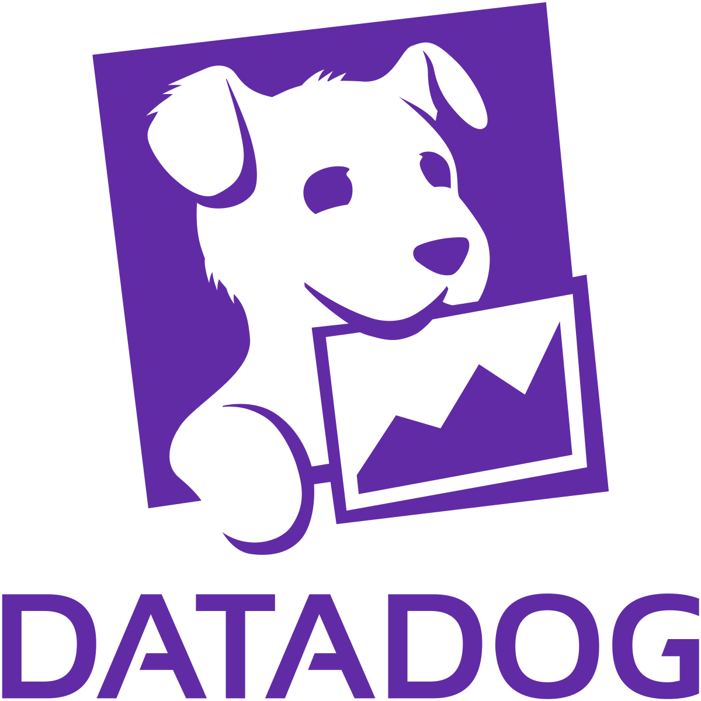

# Welcome to the DataDog tutorial! 

The point of this tutorial is to teach you how to use DataDog, which is a monitoring service for applications. 
It helps supervise servers and databases, which will be shown in this tutorial.  

## Structure of the tutorial: 

**Step 1:** Background information about DataDog

**Step 2:** Run an example app without DataDog

**Step 3:** Set up DataDog

**Step 4:** Integrate DataDog with the app 

**Step 5:** Run the app with DataDog

**Step 6:** Conclusion

