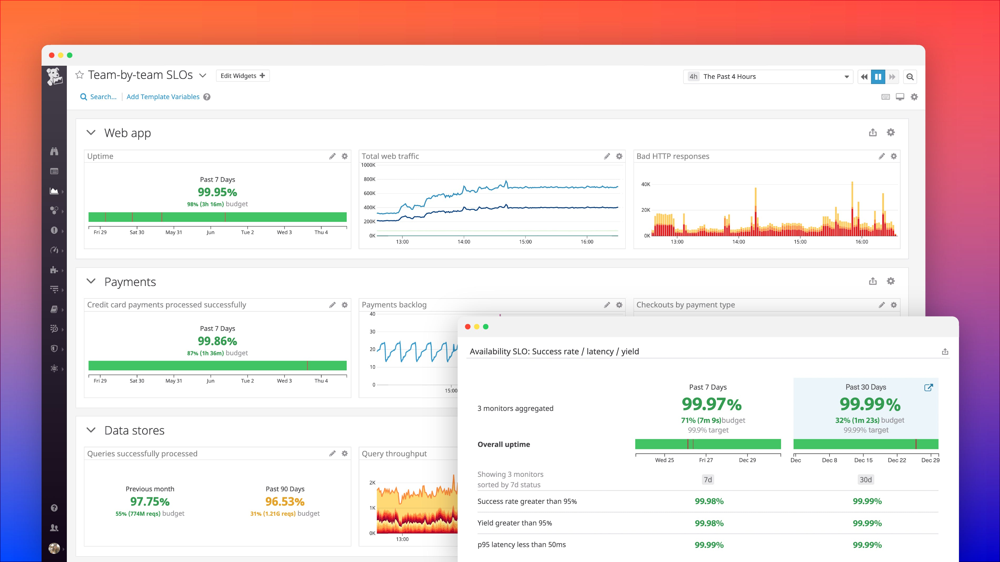

## What is DataDog? 

DataDog is an application which is used to monitor applications, servers, databases and other tools. 

## How is DataDog related to DevOps? 

DataDog increases the transparency and visibility of the environments and data. This helps different parts of the organization to have access to the same information, by using the same observation platform. Also, many several parts of the infrastructure, data... can  be monitored in the same application, which makes it much easier than having to read all individual parts' logs. 

In addition to this, DataDog automates the monitoring ang logging processes. When new infrastructures are created, they can be instantly monitored by DataDog. 

Example of how DataDog can look when monitoring an application
